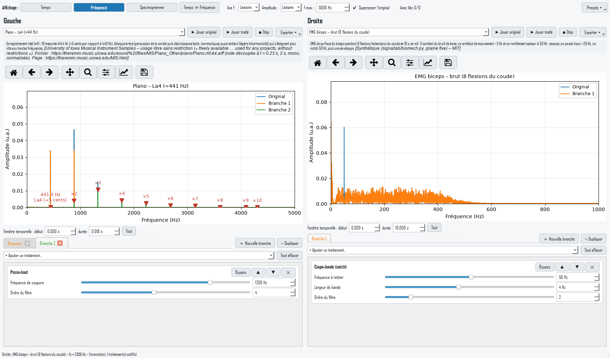

# SignalLab

Laboratoire pédagogique de **traitement du signal** : les étudiants *voient* (temps, spectre, spectrogramme)
et *entendent* l'effet des filtres et autres traitements sur des sons d'instruments, un EMG et un signal cinématique.
Interface en français, pensée pour la projection en classe (grandes polices, thème clair).



## Installation

Python 3.11 ou plus récent.

```bash
git clone <url-du-depot> SignalLab
cd SignalLab
python -m venv .venv
.venv\Scripts\activate          # Windows  (Linux/macOS : source .venv/bin/activate)
pip install -r requirements.txt
```

## Utilisation

```bash
python run.py
```

- **Deux colonnes (Gauche / Droite)** : chacune a son signal, sa chaîne de traitements et sa figure.
  Typiquement : original à gauche, version traitée à droite, ou deux instruments à comparer.
- **Affichage** (global) : *Temps*, *Fréquence* (spectre avec fondamentale, harmoniques et nom de la note + cents),
  *Spectrogramme*. Options : axe fréquentiel linéaire/log, amplitude linéaire/dB, fréquence max (zoom),
  superposition de l'original, axes liés Gauche/Droite.
- **Fenêtre temporelle** : début et durée réglables sous chaque figure (zoom). La barre matplotlib permet aussi zoom/déplacement.
- **Chaîne de traitements** : « Ajouter un traitement » (liste adaptée au type de signal), paramètres par curseur ou valeur
  numérique, boutons monter / descendre / supprimer / *Bypass*, « Tout effacer ». Le survol d'un traitement affiche
  son explication. Le recalcul est immédiat (léger délai anti-rebond de 150 ms).
- **Écoute** : ▶ Jouer original, ▶ Jouer traité, ■ Stop (un seul son à la fois). L'EMG est joué tel quel (grondement) ;
  la cinématique est accélérée pour devenir audible.
- **Presets** : EMG sans 50 Hz, enveloppe EMG, aliasing, voix « téléphone » (300–3400 Hz).
- **Export** : signal traité en WAV ou CSV, figure en PNG (menu *Exporter*).

## Tests

```bash
python -m pytest
```
Le test de la GUI tourne en mode `offscreen` et ne joue aucun son.

## Idées d'exercices pour les étudiants

1. **Harmoniques et timbre** : charger le même La4 (440 Hz) avec le piano, la flûte, le violon et le carré ;
   comparer les spectres. Pourquoi le même La sonne-t-il différemment ? Quelles harmoniques dominent ?
2. **Passe-bas progressif** : appliquer un passe-bas sur un instrument et descendre la coupure de 5 kHz à 500 Hz.
   Écouter, observer quelles harmoniques disparaissent. Que devient le timbre ?
3. **Voix téléphone** : appliquer un passe-bande 300–3400 Hz. Pourquoi la fondamentale « manquante » est-elle encore perçue ?
4. **Aliasing** : sous-échantillonner sans filtre anti-repliement avec un facteur croissant ; repérer à quelle
   fréquence apparaissent les fausses fréquences. Vérifier avec f_alias = |f − k·fs'|. Refaire en filtrant d'abord (passe-bas).
5. **Quantification** : réduire le nombre de bits et observer le plancher de bruit en dB sur le spectre.
6. **Saturation** : écrêter un sinus et compter les harmoniques créées (impaires pour un écrêtage symétrique).
7. **EMG et secteur** : sur l'EMG brut, repérer le pic à 50 Hz, puis le retirer avec un notch ;
   essayer largeur et ordre. Quel est le coût sur le contenu EMG voisin ?
8. **Enveloppe EMG** : redressement + passe-bas : comparer fc = 2, 6, 20 Hz, et la moyenne glissante ;
   quel compromis entre lissage et retard/fidélité ?
9. **Cinématique** : dériver la position deux fois (vitesse, accélération) avec et sans filtrage préalable.
   Pourquoi faut-il filtrer *avant* de dériver ?
10. **Ordre des opérations** : permuter filtre et dérivée, ou bruit et filtre, avec les boutons ▲▼ ; qu'est-ce qui change ?
11. **Résolution** : en mode spectrogramme, comparer une note tenue et une attaque brève (piano) : compromis temps/fréquence.

## Structure

`signallab/signals.py` (catalogue), `biomech.py` (EMG/cinématique), `dsp.py` (traitements),
`audio.py` (lecture), `gui/` (interface). Voir `SPEC.md`.

## Sources des sons

Sept sons sont de vrais enregistrements (piano, violoncelle, flûte, violon, clarinette, hautbois, trompette,
note La4) issus de la *University of Iowa Musical Instrument Samples* (usage libre sans restriction) ;
la sinusoïde, l'onde carrée et la guitare sont synthétisées. Détails dans `SOURCES.md` ;
régénération : `python tools/fetch_samples.py` (télécharge ~35 Mo, supprimés ensuite).

## Licence

MIT © Mickael Begon

## Environnement conda

```bash
conda env create -f environment.yml
conda activate signallab
python run.py
```

## Exécutables (Windows / macOS)

Le workflow GitHub Actions (`.github/workflows/build.yml`) lance les tests puis construit avec PyInstaller
un `.zip` Windows et un `.app` macOS : à télécharger dans l'onglet *Actions* (artefacts) ou, pour un tag `vX.Y.Z`, dans les *Releases*.
En local : `pyinstaller signallab.spec`.
